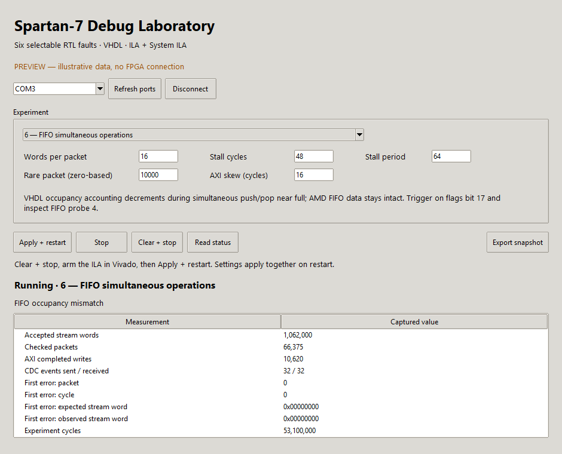
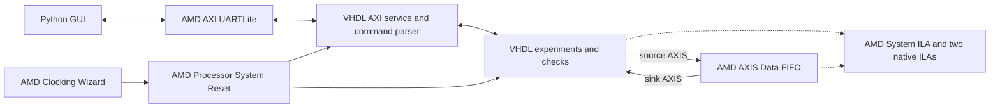

# Spartan-7 Debug Laboratory

A MicroZed Chronicles demonstration with an **IP Integrator top level, VHDL custom RTL and testbenches, AMD infrastructure IP, and a Python/Tkinter UART control panel**. One bitstream contains a healthy baseline and all six selectable faults. JTAG remains available to Vivado Hardware Manager while the GUI controls the experiment over USB-UART.



## Start here

```powershell
python -m pip install -r requirements.txt
python host/gui.py --demo
```

`--demo` is an explicitly labelled, illustrative GUI preview. It does **not** simulate the VHDL or communicate with an FPGA. To control programmed hardware:

```powershell
python host/gui.py
```

Choose the FPGA UART COM port, connect, select an experiment, use **Clear + stop**, arm the desired ILA in Vivado, then click **Apply + restart**. Settings are latched together at restart. **Stop** aborts traffic and retains diagnostic counters; **Clear + stop** resets the experiment. Each subsequent restart resets both the experiment and System ILA protocol checkers. Snapshot export saves JSON, including the settings applied through this GUI session.

## Hardware builds

Run these commands from a PowerShell with Vivado on PATH, in this project directory. No downloaded board packages are required.

```powershell
vivado -mode batch -source scripts/build.tcl -tclargs arty_s7_50 bitstream
vivado -mode batch -source scripts/build.tcl -tclargs sp701 bitstream 33.333333
```

Replace `bitstream` with `project` to generate/open the project without synthesis, or `synth` to stop after synthesis. Outputs are in `build/ipi_<board>/`: `debug_lab.xpr`, `debug_lab.bit`, `debug_lab.ltx` and implementation reports. Rebuilding replaces generated files in that board's build directory; edit source files under `rtl/`, `scripts/` and `constraints/`.

| Profile | Device | Input clock | FPGA UART RX / TX |
|---|---|---|---|
| `arty_s7_50` | XC7S50-CSGA324-1 | 12 MHz, F14 | V12 / R12 |
| `sp701` | XC7S100-FGGA676-2 | Si570 differential, AE8 / AE7 | Y22 / Y21 |

**SP701 clock:** the input argument must match the oscillator's actual configuration. This project defaults to 33.333333 MHz, following the frequency table/features in UG1319; the same guide's prose and the board-store metadata also mention 200 MHz. If your board uses 200 MHz, build with `sp701 bitstream 200`. This project does not reprogram the Si570. The LED for clock lock is a useful first check, but is not a frequency measurement.

Program the matching `.bit` and associate its `.ltx` in Hardware Manager. SRAM programming is sufficient; no flash programming is needed. USB-UART is **115200, 8-N-1, no flow control**. On SP701 select the FPGA UART channel, not the MSP430/system-controller channel. LEDs, in vector order: `[0]` running, `[1]` sticky error, `[2]` MMCM locked, `[3]` heartbeat.

The UART control registers sit outside the faulty AXI datapath, so an AXI deadlock does not prevent the GUI from stopping or restarting the laboratory.

## Experiments

| ID | Fault | Expected error bitmap with presets |
|---|---|---|
| 0 | Healthy baseline | `0x00` |
| 1 | Data counter ignores AXI-Stream backpressure | `0x05` |
| 2 | TLAST counter counts clocks instead of transfers | `0x06` |
| 3 | AXI-Lite target assumes simultaneous AW/W acceptance | `0x08` |
| 4 | Corrupt last word of selected packet after an earlier stall | `0x01` |
| 5 | Short pulse lost across the slower clock domain | `0x10` |
| 6 | FIFO occupancy decrements on simultaneous push/pop near full | `0x20` |

The stream, AXI-write and CDC laboratories run together; selection enables one fault path. Healthy mode selects the corrected behavior in all laboratories. Presets: 16 words/packet, 48 stalled cycles in each 64-cycle period, AXI skew 16 cycles, rare packet 10000 (zero-based). The CDC laboratory sends a finite batch of 32 events per restart; the other laboratories continue running.

The AXI exercise is a small write-channel transaction/response target, not a general-purpose peripheral or CPU subsystem. Its 1024-cycle timeout is an application liveness check, not a mandatory AXI response-time limit.

## Architecture and debugging

Open `debug_lab.xpr`, expand **IP INTEGRATOR**, and open `debug_system`. The board-facing top is Vivado's generated **VHDL** `debug_system_wrapper`; clocks, reset, UART, FIFO, LEDs, experiments and debug cores are all instantiated in this block design.

| Function | Implementation |
|---|---|
| 50 MHz / 12.5 MHz clocks | AMD Clocking Wizard |
| Startup and clock-lock reset | AMD Processor System Reset |
| USB-UART serial interface and RX/TX buffering | AMD AXI UARTLite, 115200 8N1 |
| UART register servicing | Small VHDL AXI-Lite sequencer; no processor or firmware |
| GUI packet protocol and experiment registers | VHDL command parser and register logic |
| Main stream storage | AMD AXI4-Stream Data FIFO, depth 16, 32-bit data + TLAST, normal mode |
| Faults, traffic generation and application checks | VHDL experiment module |
| Protocol and bus captures | AMD System ILA, three slots with protocol checkers |
| Internal state / second clock domain captures | Two AMD native ILAs |
| Heartbeat and LED wiring | AMD Binary Counter, Slice and Concat IP |



The UART's AXI bus is independent of the deliberately faulty AXI exercise, so the control panel can restart a deadlocked experiment. The stream interfaces are real IP Integrator bus connections: System ILA monitors both sides of the AMD FIFO. No custom serial PHY or storage FIFO is synthesized.

Fault 6 corrupts the **VHDL wrapper's occupancy accounting**, while the AMD FIFO continues to preserve stream data. With the presets it reports `0x20`, an occupancy mismatch without a data mismatch. This makes a useful article about distinguishing an IP failure from a bug in surrounding RTL. Pointer fields in the native trace are modulo-16 transfer counters, not probes of vendor FIFO internals.

All maintained files under `rtl/` and `sim/` are VHDL. There are no project-authored Verilog/SystemVerilog sources or AXI VIP testbenches. Some AMD-generated implementation and simulation files use vendor Verilog/encrypted models; the project therefore permits mixed-language vendor libraries. Those files stay under the generated build directory.

Both experiment clocks are related MMCM outputs. This deliberately makes the lost-pulse example reproducible; it is not an analogue metastability demonstration. Timing between the clock domains remains constrained. The healthy transfer uses a request/acknowledge handshake; the stable final count crosses back after a synchronised completion flag.

See [the IP Integrator implementation notes](docs/ip_integrator.md), [the laboratory guide](docs/lab_guide.md) for trigger recipes and article outlines, and [the register protocol](docs/protocol.md) for automation from your own Python scripts.

## Verification

```powershell
./scripts/simulate.ps1
./scripts/simulate.ps1 -Top tb_uartlite_service
vivado -mode batch -source scripts/simulate_ip.tcl -tclargs tb_debug_lab
vivado -mode batch -source scripts/simulate_ip.tcl -tclargs tb_uart_control
vivado -mode batch -source scripts/simulate_ip.tcl -tclargs tb_board_boot
python -m unittest discover -s host -p 'test_*.py' -v
python host/gui.py --demo --smoke-test
```

Generate the Arty project before running `simulate_ip.tcl`. The quick regression uses a VHDL reference queue; the IP integration regressions use the generated AMD FIFO and UARTLite models, driven by VHDL testbenches.

The VHDL tests check healthy traffic, all six fault signatures, removal of necessary fault stimuli, recovery to healthy mode, serial command/readback, checksum rejection, parser timeout/resynchronisation and clear/restart. Python tests cover framing, partial reads, noise, error replies, identity checks, settings validation and no automatic replay of uncertain commands.

Both IP Integrator board builds pass routed timing and artifact checks in Vivado 2026.1. Hardware captures still require a connected board. A successful simulation/build is not presented as an on-board test. See [validation results](docs/validation.md) for the actual checks performed.

## Vendor references

- [AMD System ILA, UG908](https://docs.amd.com/r/2024.1-English/ug908-vivado-programming-debugging/System-ILA)
- [AMD advanced trigger tutorial, UG936](https://docs.amd.com/r/2023.2-English/ug936-vivado-tutorial-programming-debugging/Step-3-Using-ILA-Advanced-Trigger-Feature-to-Trigger-on-an-AXI-Read-Transaction)
- [Digilent Arty S7-50 master XDC](https://github.com/Digilent/digilent-xdc/blob/master/Arty-S7-50-Master.xdc)
- [AMD SP701 pin definitions](https://github.com/Xilinx/XilinxBoardStore/blob/2025.2/boards/Xilinx/sp701/1.0/part0_pins.xml)
- [AMD SP701 user guide UG1319](https://docs.amd.com/api/khub/documents/1eMjAaw1mrQAHBV~fqgRng/content)

- [AMD AXI UARTLite PG142](https://docs.amd.com/api/khub/documents/dB1MAeh~uLG7FE62a5_QbA/content)
- [AMD AXI4-Stream infrastructure PG085](https://docs.amd.com/r/en-US/pg085-axi4stream-infrastructure/AXI4-Stream-Interconnect)
